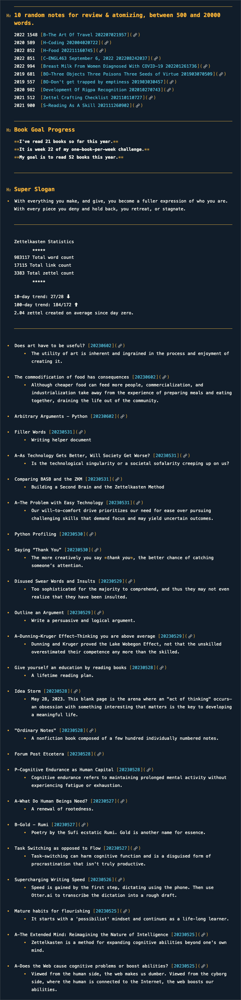

# ZK-Dashboard
Zettelkasten Stats Dashboard 

Currently, this little app is designed around the Mac software _The Archive_. It can work with other Zettelkasting apps. They must keep all the notes in the same directory in the MarkDown format. The name must include an eight-digit UID. 

Add required modules with `pip install -r requirements.txt`

```
usage: python3 zkdashboard.py

 Zettelkasten Dashboard v2.0
 Created by Will Simpson on November 15, 2021
 Modified on June 3, 2023 

```

Here is the output on my Dashboard so you can see what data is presented.



## Issues
This is a work in progress.  
If you encounter any problems, please file an issue along with a detailed description. Thank you 😃

## About zkdashboard
Created by Will Simpson - will@kestrelcreek.com

Thanks to all the über cool folks who have contributed:  
[@ZettelDistraction](https://github.com/flengyel)  
[@pryley](https://github.com/pryley)  
[@ctietze](https://github.com/DivineDominion)  

